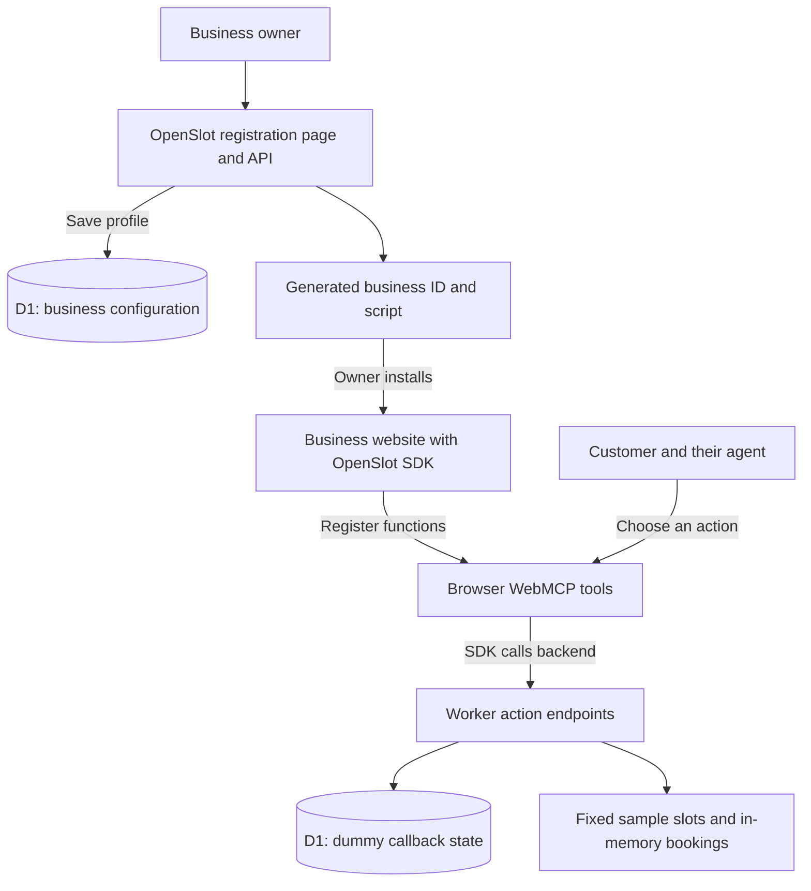

# OpenSlot — WebMCP for everyday businesses

**A drop-in script to help businesses join the agent-ready web.**

WebMCP gives websites a way to expose actions to AI agents. OpenSlot explores how to make that practical for a business that does not have a team building agent integrations.

The idea is simple: register the business, choose how it wants to handle appointments, and add one script to its existing website. OpenSlot supplies the browser tools and the service behind them. The business keeps its website; its customers gain another way to get things done there with their agents.

Our focus is **making WebMCP easier to adopt**, not building another dental booking site. The challenge demo uses a fictional dental practice to make the idea concrete. The same approach could serve salons, repair shops, fitness studios, and other appointment-based businesses.

[Watch the demo](https://youtu.be/sjeRE3hHwNY) · [Try the simulated business website](https://openslot-webmcp-demo.faizmohammed178.workers.dev/) · [Business registration](https://openslot-webmcp-demo.faizmohammed178.workers.dev/business) · [Architecture](docs/architecture.md) · [Submission copy and testing guide](docs/devpost-submission.md)

> This is a challenge prototype. Registration, WebMCP tool registration, and backend demo workflows are implemented. Availability, bookings, and phone results are simulated; no external calendar is connected and no phone call is placed. Use fictional information only. The deployed SDK and its demo workflows have also been browser-tested from a separate origin.

## One script, an existing website, new ways to help customers

The owner-facing setup produces a snippet like this:

```html
<script
  src="https://openslot-webmcp-demo.faizmohammed178.workers.dev/sdk.js"
  data-business-id="YOUR_BUSINESS_ID"
></script>
```

Replace `YOUR_BUSINESS_ID` with the ID returned by registration. It is a public routing identifier, not a password or proof of ownership.

On a supported browser, the script registers structured WebMCP functions for discovering services, finding times, holding a slot, confirming a booking, and following a callback request. An agent can use those functions instead of trying to infer the entire workflow from buttons and page text. The human chooses what they want and reviews the proposed action.

There is no customer-facing chatbot widget to install and no separate MCP server for each merchant to operate. The shared OpenSlot service handles the backend in this design. The script does **not** make a private calendar accessible by itself: real business systems would still need configuration and authorized connections.

The demo uses `document.modelContext.registerTool`. If that API is unavailable, the SDK exits without registering tools and leaves the normal website in place. See the challenge's [browser setup instructions](https://webmcp.devpost.com/resources).

## Start simple, connect more when needed

These are the intended onboarding paths, not three completed integrations:

| Business need | Intended OpenSlot experience | What the demo does today |
| --- | --- | --- |
| “I do not have online scheduling.” | Use an OpenSlot-hosted calendar; configure services, opening hours, staff, and blocked times. | Stores the hosted-calendar preference and returns fixed sample availability. There is no schedule editor yet. |
| “We already have a calendar or booking system.” | Authorize a supported connection and keep that system as the source of truth. | Stores the existing-calendar preference. No OAuth flow or external provider is connected; other business-system connectors are future work. |
| “Some requests still need a phone conversation.” | Opt into a phone workflow, verify the business number, and authorize the service to handle the agreed call flow. | Stores a callback preference and demonstrates request → poll → dummy time confirmation. The preference does not yet disable the callback tools or API. No telephony provider is connected. |

The goal is to let businesses grow into more capable integrations without rebuilding their website or maintaining a separate set of agent tools for every provider.

## What is working now

- Business registration checks required fields, saves the profile and preferences in Cloudflare D1, and returns a generated business ID. This is basic validation, not business-ownership verification.
- The setup page turns that ID into an installation snippet.
- The SDK registers seven WebMCP tools on the simulated business page in a compatible browser.
- The backend serves a business's configured service list and filters sample availability against it.
- The appointment flow supports a five-minute demo hold and a separate confirmation. Expired holds are released lazily on later API requests.
- Callback requests, their IDs, dummy options, and confirmation state are persisted in D1 and can be polled.

The repository contains the **SDK, shared backend, business setup page, simulated business website, and database migration**. It is not just a script-only mockup.

## How the current demo fits together



The hosted example puts the website, SDK, and API on the same origin. To test the drop-in boundary itself, we also loaded the deployed SDK from an independent local website origin and executed registration, service lookup, slot search, hold, confirmation, callback, polling, and dummy callback confirmation through the SDK. See the [review evidence](docs/submission-review.md).

## Demo boundaries

| Area | Current behavior |
| --- | --- |
| Scheduling data | Fixed sample dates, September 8–11, 2026. Only Cleaning, New patient exam, and Emergency consultation have sample slots. Other configured services return zero results. |
| Booking storage | Slots, holds, and ordinary appointments are held in Worker memory, not D1. They can reset or differ between Worker instances. This is not a concurrent booking guarantee. |
| Calendar modes | Both selections still use the same mock calendar. A saved preference is not a connected system. |
| Phone workflow | Dummy options are ready immediately. Polling reads stored state; it is not waiting on a real call or background queue. |
| Approval | Tool descriptions ask for user approval and distinguish reads from writes. The backend does not independently enforce consent or authentication. |
| Business scope | IDs route data, but public endpoints are not a secure multi-tenant product. Callback lookup uses a request ID; it is not owner-authorized access. |
| SDK reuse | Tool names and some descriptions still refer to dentistry/Bright Smile. General-purpose naming and business-specific descriptions are not implemented yet. |
| Cross-origin installation | The public demo allows cross-origin JSON requests and the full dummy workflow was browser-tested from a separate origin. The wildcard demo policy is not production authentication or website ownership verification. |

Do not use real customer details, patient information, business credentials, or calendar access tokens in this demo. No real appointment is booked.

## Try the demo

1. Open the [simulated business website](https://openslot-webmcp-demo.faizmohammed178.workers.dev/) in ChatGPT's in-app browser, or Chrome 149+ with the challenge's WebMCP testing flag enabled.
2. Ask the agent: “This is a simulated site. List the services, then find Cleaning appointments in the demo week of September 8, 2026. Show me the options before taking action.”
3. Choose a returned slot, ask the agent to hold it, then explicitly approve a dummy confirmation using fictional details. Do not invent slot or hold IDs.
4. Try: “Request a simulated callback for a New patient exam. Poll the returned request ID and show me the dummy options. Do not confirm until I choose.”
5. Open [business registration](https://openslot-webmcp-demo.faizmohammed178.workers.dev/business) to inspect the owner journey. Saving with fictional details creates a demo record and an ID-specific snippet; it does not connect a calendar or activate phone service.

No login or API key is required. The regular website will load in other browsers, but that alone does not prove WebMCP discovery. Opening the Bright Smile homepage after registering another business still uses Bright Smile's embedded ID; registration does not automatically generate a new business website.

For exact tool inputs, sample-data caveats, and a second-business check, see the [testing guide](docs/devpost-submission.md#testing-instructions).

## WebMCP functions in this prototype

| Function | Purpose |
| --- | --- |
| `get_dental_services()` | Read the registered business's services. |
| `search_dental_appointment_slots({ service, dateRange })` | Find matching sample availability. |
| `hold_dental_appointment_slot({ slotId })` | Create a temporary in-memory hold. |
| `confirm_dental_appointment({ holdId, name, email })` | Confirm a dummy appointment. |
| `request_dental_callback({ service, preferredTimes })` | Create a stored dummy callback request. |
| `poll_dental_callback_status({ callbackId })` | Read that request's status and options. |
| `confirm_dental_callback_time({ callbackId, slotId })` | Confirm one of its dummy options. |

Use the callback response's `requestId` as `callbackId` for the next tool; `id` and `requestId` contain the same value.

## Run locally

Use Node.js 22+ and npm. These commands fetch Wrangler 4 without requiring a globally installed CLI. Run them from the repository root:

```sh
git clone https://github.com/faiz121/openslot-webmcp.git
cd openslot-webmcp
npx wrangler@4 d1 migrations apply openslot-webmcp --local
npx wrangler@4 dev
```

Open `http://localhost:8787/` or `http://localhost:8787/business`. Keep the `DB` binding configured and apply the migration: the no-D1 fallback is not a reliable multi-business test environment. Local D1 is separate from the hosted database. See [Cloudflare's local D1 guide](https://developers.cloudflare.com/d1/best-practices/local-development/).

The setup page's generated snippet currently hardcodes the public demo SDK URL. For local testing, replace its `src` with `/sdk.js` when embedding on your local Worker origin. This avoids accidentally sending local test data to the public demo.

Run `npm test` for the tracked CORS regression checks. `node --check src/index.js` provides an additional syntax-only check; the repository does not yet include a complete booking regression suite.

## Deploy your own demo

Use your own Cloudflare account and database; the checked-in database ID belongs to the public challenge demo.

1. Run `npx wrangler@4 login` and `npx wrangler@4 d1 create openslot-webmcp`.
2. Put the returned `database_id` in your local `wrangler.toml`, keeping the binding named `DB`. Choose your own Worker name if needed.
3. Replace the public demo SDK URL in the setup page's snippet strings in `src/index.js` with your deployed SDK URL. The embedded Bright Smile page already uses `/sdk.js`.
4. Apply the migration, then deploy:

```sh
npx wrangler@4 d1 migrations apply openslot-webmcp --remote
npx wrangler@4 deploy
```

The Worker serves the HTML pages, SDK, and API from `src/index.js`. The `public/` directory is configured for static assets and currently contains only a placeholder. No calendar, telephony, or model-provider credentials are needed for the simulation.

## Next steps

Next, make the tools and their descriptions business-neutral, then build the hosted schedule editor and one authorized calendar connector, with optional telephony behind an enforced business preference.

Before any real bookings, add verified business accounts, server-side authorization and approval checks, durable conflict-safe booking state, idempotent confirmations, privacy controls, and provider failure handling. These are launch prerequisites, not features to postpone until scale. See the [proposed architecture](docs/architecture.md#proposed-production-path-not-implemented).

## License

MIT. See [LICENSE](LICENSE).
