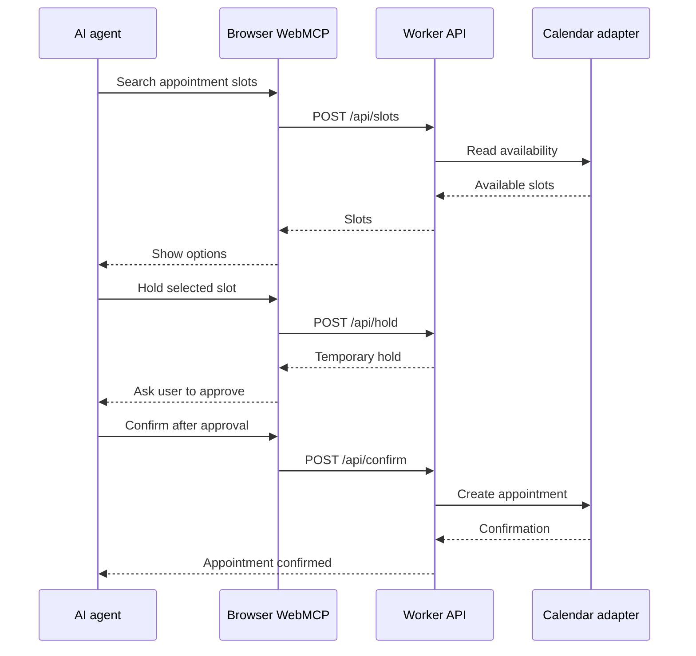
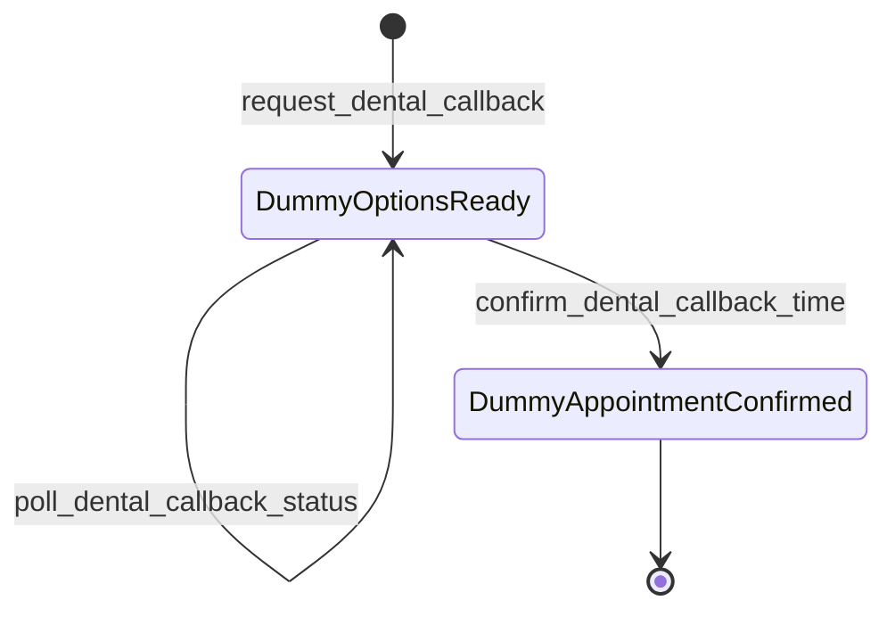
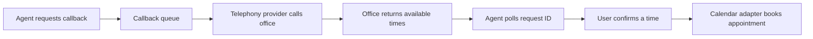
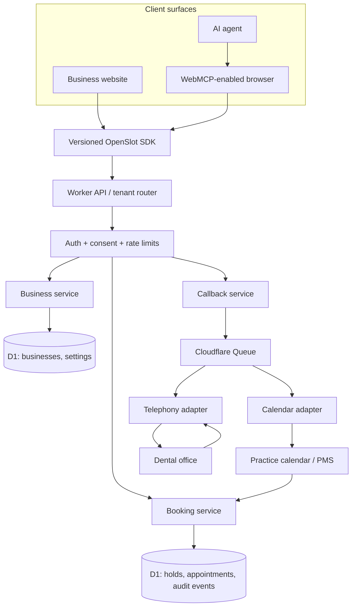

# OpenSlot WebMCP demo

OpenSlot is a small reference implementation for making ordinary business websites agent-bookable. A business adds one script; OpenSlot owns the stable agent-facing tool contract and the consent boundary, while calendar and telephony adapters absorb the differences between providers. WebMCP is the zero-install browser surface today, not the limit of the platform.

The public demo uses a simulated dental practice, but the pattern can extend to restaurants, home services, clinics, and other businesses with appointment or callback workflows.

Live demo: https://openslot-webmcp-demo.faizmohammed178.workers.dev/

## What is included

- `/` — simulated Bright Smile Dental patient website
- `/business` — simulated practice-owner setup page
- `/sdk.js` — embeddable WebMCP registration script
- D1-backed business registration and generated business IDs
- Mock appointment search, hold, and confirmation
- Hosted-calendar and existing-calendar integration choices
- Simulated phone-callback request, polling, dummy options, and confirmation (no real calls are placed)

The business setup page explains the intended integration model: a practice owner registers the business, chooses a calendar connection, saves the setup to D1, and receives a generated business ID for the website script. The practice can continue owning its booking configuration while the service handles the agent-facing tools and distribution boundary.

## Architecture

### What the demo does today

The practice owner uses `/business` to register a practice. The Worker generates a business ID, stores the practice configuration in D1, and returns the script snippet containing that ID. The owner adds the snippet to the practice's booking page. A compatible browser loads the SDK silently and the SDK registers tools with the browser's WebMCP context.

The business ID is the tenant boundary for the demo: services, slots, holds, appointments, and callback requests are associated with the business that supplied the ID. The business registry in D1 is the beginning of a future directory of agent-ready businesses.

```mermaid
flowchart LR
    Owner[Practice owner] --> Setup[Business setup page]
    Setup -->|Save practice setup| Worker[Cloudflare Worker]
    Worker -->|Create business ID + save profile| D1[(Cloudflare D1 registry)]
    Worker -->|Return generated snippet| Setup
    Setup -->|Owner copies script| Site[Practice booking page]
    Site --> SDK[SDK script]
    SDK -->|registerTool| Context[Browser WebMCP context]
    Context -->|Agent discovers tools| Agent[AI agent]
    Agent -->|Tool requests| Worker
    Worker --> D1
    D1 --> Directory[Agent-ready business directory]
```



### Appointment booking flow

The booking tools intentionally separate read and write actions. The agent can search availability, but holding and confirming a slot are state-changing operations that should require user approval.



### Phone callback flow

The callback flow is asynchronous by design. The initial request returns a request ID. An agent can poll that ID and then confirm one of the proposed times.



The same state machine can later sit in front of a real telephony provider:



## What is mocked versus what is real

| Area | Current demo | Ideal implementation |
| --- | --- | --- |
| Practice registration | Real Worker endpoint and D1 persistence | Add authentication, ownership verification, and tenant isolation |
| Business ID | Generated on save, used to scope demo data, and inserted into the script snippet | Stable public identifier plus private account/tenant ID |
| Hosted calendar | Sample slots from a fixed in-memory service template, scoped per business ID and filtered by configured services | D1-backed availability with working hours, providers, services, holidays, holds, and expiration |
| Existing calendar | Selection is stored, but no provider is connected | OAuth-based adapters for Google Calendar, Calendly, or practice-management systems |
| WebMCP SDK | Real script that registers seven tools when `registerTool` exists | Versioned SDK, origin checks, capability discovery, and backward-compatible tool contracts |
| Phone callback | Returns matching dummy appointment options when available; no call is placed | Queue a request, call through a telephony provider, receive office results, and expose status via request ID |
| Appointment confirmation | Changes demo state only | Idempotent booking with conflict checks, provider webhooks, audit trail, and reconciliation |
| Security | Public demonstration endpoints | Authentication, authorization, rate limits, consent, PII controls, secrets management, and audit logs |

## What happens after a practice owner submits the form

1. The Worker validates the practice details and generates a business ID such as `biz-a1b2c3d4`.
2. The business profile and selected integration mode are stored in D1.
3. The setup page displays a script containing that business ID.
4. The owner adds the script to the practice's booking page.
5. A compatible browser loads the SDK. Normal visitors see the regular website; the tools are exposed to the browser's WebMCP context in the background.
6. The owner eventually configures either the hosted calendar or an authorized external calendar adapter.
7. Agents can search, hold, and confirm appointments, or request a callback and follow its status using the request ID.

## Ideal production architecture

The first production version can remain a small modular service: a stateless Worker API, D1 for practice configuration and appointment state, a queue for callbacks and provider work, and adapters around calendar and telephony providers. Slow or retryable provider calls should not block the browser request.



The key boundary is the adapter layer. The WebMCP tools should stay stable while each calendar or telephony provider implements the provider-specific details behind the API. Booking and confirmation should use stable idempotency keys, explicit hold expiration, provider webhook handling, and reconciliation jobs so retries cannot create duplicate appointments.

WebMCP is only one delivery surface. The same OpenSlot tool contract could later be exposed through a hosted MCP endpoint, a voice agent, or another agent platform. That keeps businesses from having to build a separate integration for every agent surface.

For concurrent booking, a production implementation should serialize hold and confirm operations per business. A Durable Object keyed by business ID is a natural Cloudflare-native option for that single-writer boundary, while D1 remains the durable source of truth. This prevents two agents from successfully claiming the same appointment during a race.

The D1 business registry can also become a directory of agent-ready businesses. Each new business increases the set of useful destinations available to agents, while the stable tool contract keeps discovery and booking consistent across businesses.

### Suggested production phases

- **Demo:** in-memory slots, D1 business profiles, dummy callbacks, and visible test disclosures.
- **Pilot:** authenticated business accounts, a real hosted-calendar data model, one calendar adapter, one telephony provider, durable callback queue, and audit logs.
- **Scale:** provider webhooks, retries and dead-letter queues, idempotent booking, reconciliation jobs, observability dashboards, tenant-level rate limits, and stronger privacy controls.

## WebMCP tools

The script registers these tools when the host browser exposes `document.modelContext.registerTool`:

- `get_dental_services`
- `search_dental_appointment_slots`
- `hold_dental_appointment_slot`
- `confirm_dental_appointment`
- `request_dental_callback`
- `poll_dental_callback_status`
- `confirm_dental_callback_time`

The calendar adapters and telephony integration are intentionally simulated for a demo. Callback requests return dummy appointment options, and confirmation only changes the demo request state. Do not use this project with real patient information, production calendars, or real telephony without adding authentication, authorization, tenant isolation, audit logging, privacy controls, and provider-specific adapters.

The demo calendar contains only a fixed sample set of services and times. A configured service that is not represented in that sample data will correctly return zero demo results; that does not indicate a failed production calendar integration.

## Run locally

```sh
npx wrangler dev
```

Then open `http://localhost:8787/` or `http://localhost:8787/business`.

## Deploy

```sh
npx wrangler deploy
```

Apply the D1 migration before the first production deploy:

```sh
npx wrangler d1 migrations apply openslot-webmcp --remote
```

Cloudflare Workers serves both the Worker API and the static files in `public/`; D1 stores businesses and callback request state.

## License

MIT. See [LICENSE](LICENSE).
