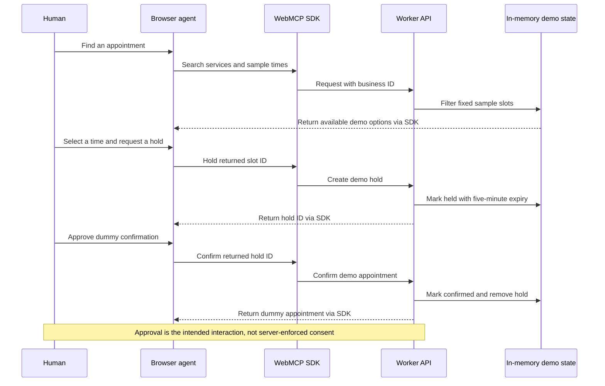
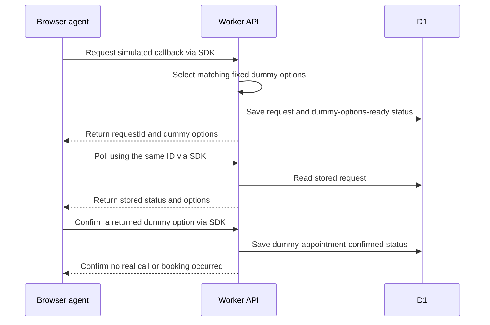
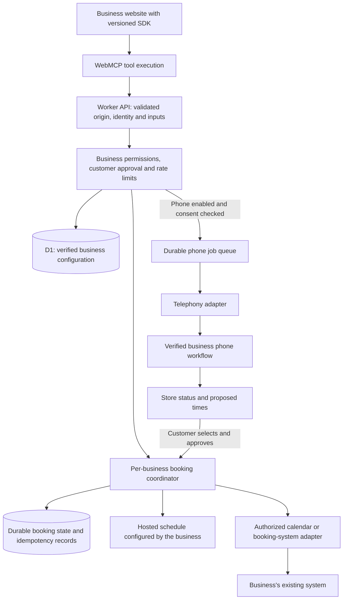

# OpenSlot architecture: a small integration for the business, a shared service behind it

## Product boundary

OpenSlot aims to make WebMCP adoption approachable for everyday businesses. The merchant adds a script and configures the business; OpenSlot maintains the tool implementation and the integrations behind it. The website remains useful to human visitors.

WebMCP is the focus of this prototype. It makes the site's structured actions available to a compatible browser agent. It does not provide calendar access, telephony, business authentication, or booking consistency on its own. Those are responsibilities of the service behind the script.

## Deployed implementation

The complete app is in [`src/index.js`](../src/index.js). [`wrangler.toml`](../wrangler.toml) binds the Worker to D1. The [migration](../migrations/0001_create_businesses_and_callbacks.sql) creates `businesses` and `callbacks` tables only.

### Owner setup and SDK loading

1. The owner submits fictional name, address, phone, services, and preferences on `/business`.
2. `/api/business/register` checks required fields and allowed integration values, generates a `biz-…` identifier, and stores the profile in D1.
3. The browser builds a snippet using that identifier. It is not a secret.
4. When the business page loads the script, the SDK captures its business ID and API origin. It registers tools after the document is ready if `document.modelContext.registerTool` exists.
5. Tool execution calls the shared API. The browser does not receive provider credentials; none are needed for the demo.

The SDK can register without changing the business page's layout. Its optional output helper only updates an element marked `data-agent-output` if one exists. The stock Bright Smile page has no such element; agent results should be viewed in the browser's agent interface, not described as a built-in activity dashboard.

The hosted demonstration is same-origin, but the SDK-to-API boundary is also tested from a separate browser origin. API responses and preflight responses permit the demo's JSON requests. This permissive CORS policy only enables the browser call; it is not authentication, business ownership verification, or authorization.

### Where state actually lives

| State | Storage today | Consequence |
| --- | --- | --- |
| Business profiles and preferences | D1 | Persist across Worker restarts. |
| Callback request, dummy options, and confirmation | D1, with a memory fallback | Pollable by request ID; no background call runs. |
| Sample slot availability, holds, ordinary appointments | Module-level Maps and arrays | Not durable or shared across Worker instances. |
| Calendar connection credentials | Nowhere | No real calendar integration exists. |
| Telephony jobs and provider credentials | Nowhere | No queue, dialer, or real calls exist. |

Business IDs route profile and sample-slot requests. They do not establish a trusted tenant boundary. Callback reads/confirmation are request-ID based and not protected by account authorization. The no-D1 fallback can return the default profile for unknown IDs and must not be used to claim multi-business isolation.

### Appointment workflow today

The next API request releases expired holds. This is lazy expiry, not a scheduled job. Holds and confirmations have no idempotency keys, durable transaction boundary, or protection against independent Worker instances making conflicting decisions. A failed or repeated request must not be treated as proof of a real booking.

Availability is a fixed template, filtered against configured services. Free-text date matching is intentionally limited; it is not a production scheduling engine. Slot IDs must come from a fresh search, and unsupported services should yield no options.

### Phone workflow today

The stored phone preference is not yet enforced: the SDK always exposes callback tools, and the API does not check `callbackEnabled`. The present UI describes a callback from the office; a future agent calling the business on the customer's behalf is a different call direction that must be explicitly configured. The simulation proves neither direction is integrated.

## Proposed production path (not implemented)

Keep the SDK small. Put provider differences and durable workflows behind the service so a merchant can connect more systems without rewriting the website integration.

This is a proposed design, not a diagram of deployed infrastructure. In particular:

- **Start simple:** a hosted calendar needs a real editor for opening hours, services, staff/resource capacity, time zones, and blocked dates. OpenSlot cannot infer a business's private availability from its website.
- **Connect existing systems:** the business must authorize a supported adapter. That system remains the authority for its own availability and bookings. Calendar read access alone does not guarantee appointment-booking support.
- **Add phone help:** verify ownership and the intended call direction, enforce opt-in and consent, then use a provider and durable jobs. Initial responses return request IDs; provider events update status. Phone conversations may propose times, but those must be revalidated or explicitly confirmed with the business before reporting a booking.
- **Own booking state:** a SQLite-backed Durable Object per business is one possible coordinator for the hosted calendar. It would own durable hold/confirmation transitions and idempotency records; D1 can retain business configuration and reporting data. Do not use a DO merely as a lock around unrelated memory or imply it makes an external calendar transaction atomic.
- **Handle external conflicts:** provider-native conflict checks, idempotency where supported, webhooks, and reconciliation are still necessary. A local coordinator cannot prevent an appointment entered directly into an external business system.

See Cloudflare's [Durable Objects overview](https://developers.cloudflare.com/durable-objects/concepts/what-are-durable-objects/) for the coordination primitive, and [Workers guidance](https://developers.cloudflare.com/workers/best-practices/workers-best-practices/) for the limits of module-level state.

### Before a real-business pilot

1. Verify business accounts and website ownership. Enforce configured origins, capabilities, callback opt-in, and authorized access to every request and booking. CORS is not an access-control substitute.
2. Generalize dental-specific tool names and descriptions, add contract versioning, and turn the separate-origin browser check into a repeatable integration test. A stable interface is the goal; it is not a versioned guarantee today.
3. Build one reliable scheduling path with durable state, conflict checks, idempotent writes, hold expiry, and safe retry behavior before accepting real appointments.
4. Capture and enforce approval for material actions. An agent-facing instruction to ask permission is not evidence of consent at the backend.
5. Add privacy and retention controls, provider secret management, rate limits, audit events, and recoverable provider-failure handling. Remove or secure demo-only reset/state endpoints.
6. Add optional telephony only after the booking flow and business authorization work. A queued request is not a completed phone call or confirmed appointment.

These are prerequisites for real transactions, not “scale later” enhancements. A directory of participating businesses or another agent access channel could follow, but neither is implemented or required to demonstrate OpenSlot's WebMCP adoption story.
